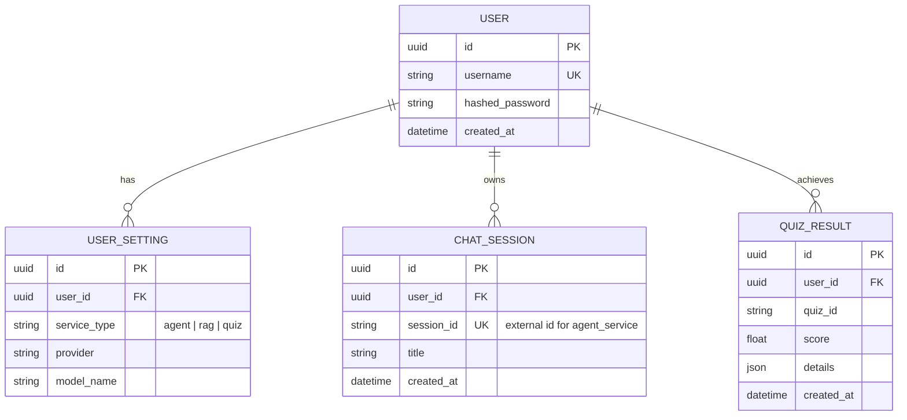

ser_service/docs/architecture.md</path>
<content lines="1-60">
# Архитектура User Service

Сервис `user_service` предназначен для централизованного управления пользователями, их аутентификацией, персональными настройками и историей взаимодействия с системой.

## Технологический стек

- **FastAPI**: Основной веб-фреймворк для реализации API.
- **PostgreSQL**: Реляционная база данных для хранения профилей, настроек и истории.
- **SQLAlchemy (Async)**: ORM для асинхронного взаимодействия с базой данных.
- **Alembic**: Инструмент для управления миграциями базы данных.
- **Pydantic**: Валидация данных и описание схем API.
- **Passlib (bcrypt)**: Хеширование паролей.
- **Python-jose**: Работа с JWT токенами.

## Схема базы данных (ER Diagram)

## Описание таблиц

### User (Пользователь)
- `id` (UUID): Уникальный идентификатор.
- `username` (String): Уникальное имя пользователя.
- `hashed_password` (String): Хеш пароля.
- `is_active` (Boolean): Флаг активности аккаунта.
- `created_at` (DateTime): Дата регистрации.

### UserSetting (Настройки LLM)
- `id` (UUID): Уникальный идентификатор.
- `user_id` (UUID): Ссылка на пользователя.
- `service_type` (String): Тип сервиса (`agent`, `rag`, `quiz`).
- `provider` (String): Провайдер LLM (например, `openai`, `zai`).
- `model_name` (String): Название выбранной модели.

### ChatSession (Сессии чата)
- `id` (UUID): Внутренний ID.
- `user_id` (UUID): Владелец сессии.
- `session_id` (String): Внешний ID сессии в `agent_service`.
- `title` (String): Название сессии (для отображения в списке).
- `created_at` (DateTime): Дата создания.

### QuizResult (Результаты тестов)
- `id` (UUID): Уникальный идентификатор.
- `user_id` (UUID): Ссылка на пользователя.
- `quiz_id` (String): ID теста из `test_generator`.
- `score` (Float): Процент правильных ответов.
- `details` (JSON): Детальная информация об ответах.
- `created_at` (DateTime): Дата прохождения.

## Изоляция данных

Сервис обеспечивает строгую изоляцию данных:
1. Доступ к настройкам и истории возможен только после успешной JWT-авторизации.
2. Все запросы к БД фильтруются по `user_id`, извлеченному из токена.
3. Пользователь имеет доступ только к своим 5 последним сессиям (лимит для прототипа) и сессиям системны�� тестов.