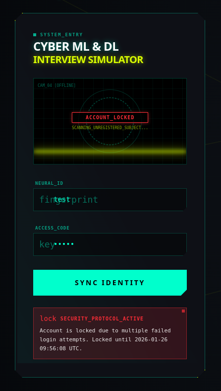

# Защита от Brute Force атак

В `user_service` реализован механизм защиты от перебора паролей (brute force), который ограничивает количество неудачных попыток входа и временно блокирует доступ к аккаунту.

## Механизм работы

1.  **Отслеживание попыток**: В таблицу `users` добавлены поля:
    *   `failed_login_attempts` (Integer): Счетчик последовательных неудачных попыток входа.
    *   `locked_until` (DateTime): Время, до которого аккаунт заблокирован.

2.  **Лимиты**:
    *   Максимальное количество попыток: **5**.
    *   Длительность блокировки: **5 часов**.

3.  **Логика API (`/auth/login`)**:
    *   При каждой неудачной попытке (неверный пароль) счетчик `failed_login_attempts` увеличивается.
    *   При достижении лимита (5 попыток) поле `locked_until` устанавливается как `текущее время + 5 часов`.
    *   Если пользователь пытается войти в заблокированный аккаунт, API возвращает статус `403 Forbidden` с сообщением о блокировке и временем её окончания.
    *   При успешном входе счетчик попыток и время блокировки сбрасываются в `0` и `null` соответственно.

## Безопасность

*   Блокировка происходит только для существующих пользователей. Если пользователь не найден, возвращается стандартная ошибка `401 Unauthorized` без изменения состояния БД.
*   Сообщения об ошибках на фронтенде стилизованы под общий киберпанк-интерфейс ("Security Protocol Active").

## Техническая реализация

*   **Миграция**: `eefcc9832520_add_failed_login_attempts_and_locking.py`
*   **Модель**: [`User`](../app/models/user.py)
*   **Контроллер**: [`login_for_access_token`](../app/api/auth.py)
*   **Тесты**: [`user_service/tests/test_brute_force.py`](../tests/test_brute_force.py)