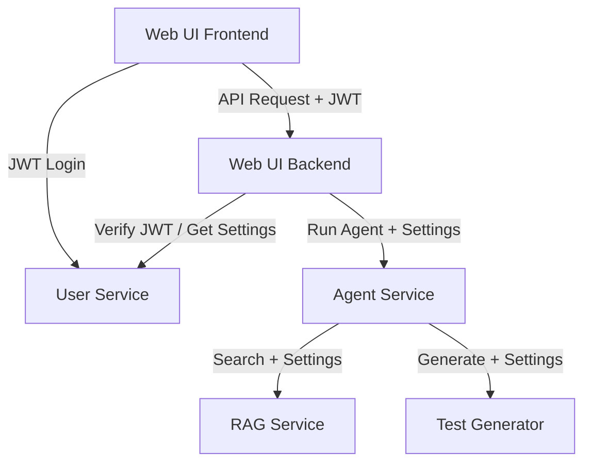

# Взаимодействие User Service с компонентами системы

User Service является центральным хранилищем данных о пользователях и их предпочтениях.

## Схема взаимодействия

## Ключевые сценарии

### 1. Аутентификация
1. Пользователь вводит логин/пароль во фронтенде.
2. Фронтенд отправляет запрос в `Web UI Backend`.
3. `Web UI Backend` проксирует запрос в `User Service: POST /auth/login`.
4. `User Service` проверяет хеш пароля в PostgreSQL и возвращает JWT токен.
5. Фронтенд сохраняет JWT и использует его для всех последующих запросов.

### 2. Загрузка настроек и сессий
1. При входе в раздел "Настройки" фронтенд запрашивает данные через `Web UI Backend`.
2. `Web UI Backend` запрашивает `User Service: GET /settings`.
3. `User Service` возвращает JSON с выбранными моделями для Agent, RAG и Quiz.

### 3. Запуск агента с пользовательскими настройками
1. Фронтенд отправляет `POST /agent/run`.
2. `Web UI Backend` извлекает `user_id` из JWT.
3. `Web UI Backend` запрашивает актуальные настройки пользователя из `User Service`.
4. `Web UI Backend` отправляет запрос в `Agent Service`, включая в него объект настроек.
5. `Agent Service` инициализирует LLM с указанными параметрами.

### 4. Сохранение результатов
1. После завершения квиза `Agent Service` отправляет уведомление в `Web UI Backend`.
2. `Web UI Backend` отправляет команду на сохранение в `User Service: POST /quiz/results`.

### 5. Управление пользователями (CLI)
Администратор использует скрипты в контейнере `user-service` для управления доступом:
- `python scripts/register_user.py <username> <password>` — создание пользователя.
- `python scripts/delete_user.py <username>` — удаление пользователя и всех данных.
- `python scripts/list_users.py` — просмотр списка пользователей.